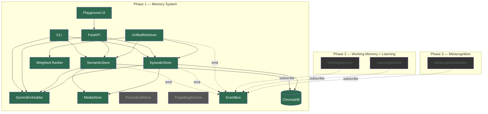

# agentic-memory

A cognitive memory framework for AI agents, built on the taxonomy from [Measuring Progress Toward AGI: A Cognitive Framework](research-docs/measuring-progress-toward-agi-a-cognitive-framework.pdf).

Most agent memory systems are a single vector store. This project implements memory the way cognitive science describes it: **separate stores for different memory types** (semantic facts, episodic events, procedural skills), a **unified retriever** with weighted ranking, a **forgetting service** for pruning stale knowledge, and an **event bus** for lifecycle observability.

Built on **Gemini Embedding 2** for natively multimodal embeddings — text, images, audio, video, and PDFs share a single 768-dimensional vector space.

---

## Quickstart

### 1. Install dependencies

```bash
python3 -m venv .venv
source .venv/bin/activate
pip install -r requirements.txt
```

### 2. Set up environment

Create a `.env` file in the project root:

```
GEMINI_API_KEY=your_key_here
```

### 3. Install system dependencies

Audio and video chunking requires ffmpeg:

```bash
# arch
sudo pacman -S ffmpeg

# ubuntu/debian
sudo apt install ffmpeg

# mac
brew install ffmpeg
```

### 4. Start the API server

```bash
.venv/bin/python -m uvicorn api.app:app --port 8000 --reload
```

The API is now running at `http://localhost:8000`. Interactive docs at `http://localhost:8000/docs`.

### 5. Start the playground UI

```bash
cd web
npm install
NEXT_PUBLIC_MEMORY_API_BASE_URL=http://localhost:8000 npm run dev
```

The playground is now running at `http://localhost:3000`.

---

## CLI

```bash
# Store a semantic fact
python demo/cli.py store "Python was created by Guido van Rossum"

# Store a semantic fact with an image
python demo/cli.py store "Architecture whiteboard from the design review" --image ./whiteboard.png

# Query memories by text
python demo/cli.py query "Who created Python?" -k 5

# Query memories by image
python demo/cli.py query-by-image ./diagram.png -k 5

# Query memories by audio
python demo/cli.py query-by-audio ./meeting.mp3 -k 5 --memory-types semantic

# Store a text episodic memory
python demo/cli.py store-episode --session session-debug --text "We fixed the ranking bug"

# Store a file-backed episodic memory
python demo/cli.py store-episode --session session-review --file ./screenshot.png --modality image

# Store a multimodal episodic memory
python demo/cli.py store-episode --session session-handoff --file ./notes.pdf --modality multimodal

# Show recent episodes
python demo/cli.py recent 5
```

---

## API

### Memory storage

| Method | Endpoint | Description |
|--------|----------|-------------|
| POST | `/api/memories/semantic` | Store a semantic fact (text or media-backed) |
| POST | `/api/memories/episodic/text` | Store a text episodic memory |
| POST | `/api/memories/episodic/file` | Store a file-backed episodic memory |

### Retrieval

| Method | Endpoint | Description |
|--------|----------|-------------|
| POST | `/api/retrieval/query` | Text query with ranked results |
| POST | `/api/retrieval/query-by-image` | Image upload query (file upload, returns ranked results) |
| POST | `/api/retrieval/query-by-audio` | Audio upload query (file upload, returns ranked results) |

### Exploration

| Method | Endpoint | Description |
|--------|----------|-------------|
| GET | `/api/episodes/recent?n=5` | Recent episodic memories |
| GET | `/api/episodes/session/{id}` | All episodes in a session |
| GET | `/api/episodes/time-range?start=...&end=...` | Episodes in a time window |

### System

| Method | Endpoint | Description |
|--------|----------|-------------|
| GET | `/api/overview` | Collection counts, recent sessions, latest events |
| GET | `/api/events?limit=40` | Event stream (stored, retrieved, ranked, accessed) |
| GET | `/health` | Health check |

---

## Architecture



Green = built. Grey = planned (Phase 1). Dark = future phases.

---

## Memory types

The cognitive framework distinguishes memory sub-types with different storage, retrieval, and decay semantics. Each type is a separate ChromaDB collection behind a shared `BaseStore` interface.

| Type | Store | Purpose | Status |
|------|-------|---------|--------|
| **Semantic** | `SemanticStore` | Facts, knowledge, concepts | Built |
| **Episodic** | `EpisodicStore` | Events, experiences, sessions | Built |
| **Procedural** | `ProceduralStore` | Skills, tool sequences, strategies | Planned |

All stores support text and multimodal (image, audio, video, PDF) records.

---

## Multimodal support

All modalities are embedded into the same 768-dimensional vector space via [Gemini Embedding 2](https://ai.google.dev/gemini-api/docs/embeddings).

| Modality | Storage | Text query | Media query |
|----------|---------|------------|-------------|
| Text | Semantic, Episodic | Yes | — |
| Image | Semantic, Episodic | Via content label | query-by-image |
| Audio | Semantic, Episodic | Via content label | query-by-audio |
| Video | Episodic | Via content label | — |
| PDF | Episodic (multimodal) | Via content label | — |

Long audio (>80s) and long video (>120s) are automatically chunked, embedded per-chunk, averaged, and re-normalized.

Media files are copied into an app-owned directory (`data/media/`) with structured subdirectories (images, audio, video, documents). The `MediaStore` handles lifecycle, ownership validation, and cleanup on failure.

---

## Retrieval pipeline

The `UnifiedRetriever` queries across all stores and applies weighted ranking:

```
query → fan-out to stores (3x over-fetch) → collect candidates →
  rank by (relevance × 0.4 + recency × 0.3 + importance × 0.3) →
  truncate to top_k → update access tracking → emit events → return
```

Both text queries and vector queries (from image/audio embeddings) flow through the same pipeline. Vector queries bypass the embedder and go directly to the stores via `retrieve_by_vector()`.

---

## Event system

All store and retrieval operations emit events through the `EventBus`:

| Event | When |
|-------|------|
| `memory.stored` | After a record is persisted |
| `memory.retrieved` | After candidates are fetched (pre-ranking) |
| `memory.ranked` | After ranking is applied |
| `memory.accessed` | After access count is updated |

Events are immutable (frozen payloads) and visible in the playground UI's event stream and via `GET /api/events`.

---

## Testing

All tests run offline with deterministic embedders (no Gemini API key required):

```bash
# Run all tests
.venv/bin/python -m pytest tests/

# Individual test files
.venv/bin/python tests/test_semantic_store.py
.venv/bin/python tests/test_episodic_store.py
.venv/bin/python tests/test_retriever.py
.venv/bin/python tests/test_event_integration.py
.venv/bin/python tests/test_media_store.py
.venv/bin/python tests/test_cli.py
.venv/bin/python -m pytest tests/test_api.py

# Offline episodic evaluation harness
.venv/bin/python tests/test_offline_episodic_eval.py
```

---

## Project structure

```
agentic-memory/
├── config.py                  # API keys, model config, paths
├── models/
│   ├── base.py                # MemoryRecord dataclass, modality normalization
│   ├── semantic.py            # SemanticMemory (facts, knowledge)
│   └── episodic.py            # EpisodicMemory (events, sessions)
├── utils/
│   ├── embeddings.py          # GeminiEmbedder — text, image, audio, video, PDF, multimodal
│   └── retry.py               # Exponential backoff with jitter
├── stores/
│   ├── base.py                # Abstract BaseStore interface
│   ├── semantic_store.py      # ChromaDB-backed semantic store
│   ├── episodic_store.py      # ChromaDB-backed episodic store
│   └── media_store.py         # Local file storage with ownership tracking
├── retrieval/
│   ├── retriever.py           # UnifiedRetriever — fan-out, ranking, access tracking
│   └── ranking.py             # Weighted scoring (relevance, recency, importance)
├── events/
│   ├── bus.py                 # Synchronous pub/sub EventBus
│   └── logger.py              # Console event formatter
├── api/
│   └── app.py                 # FastAPI server — storage, retrieval, events, overview
├── demo/
│   └── cli.py                 # CLI for all memory operations
├── web/                       # Next.js playground UI
├── tests/                     # Offline deterministic test suite
├── experiments/               # Audio emotion probes, benchmarks
├── docs/                      # Issue plans, evaluation docs
└── research-docs/             # Source papers
```

---

## Theoretical foundation

This project implements the cognitive taxonomy from the DeepMind paper *Measuring Progress Toward AGI*. The paper distinguishes three faculties that most agent frameworks conflate:

- **Memory** — passive storage and retrieval (semantic facts, episodic events, procedural skills)
- **Working Memory** — active manipulation of information for a current goal
- **Learning** — acquisition and consolidation of new knowledge into long-term memory

Phase 1 builds the memory stores. Phase 2 adds working memory and a learning module. Phase 3 adds metacognitive monitoring — the system's ability to assess confidence in its own retrieved context.

---

## Roadmap

- [x] Semantic memory store (text + multimodal)
- [x] Episodic memory store (text + file-backed + multimodal)
- [x] Unified retriever with weighted ranking
- [x] Event bus with lifecycle events
- [x] Media store with ownership tracking
- [x] Cross-modal retrieval (query by image, query by audio)
- [x] CLI with full multimodal support
- [x] FastAPI with storage, retrieval, and event endpoints
- [x] Playground UI with text, image, and audio queries
- [ ] PDF chunk-level retrieval ([#30](https://github.com/agentclash/agentic-memory/issues/30))
- [ ] Procedural memory store
- [ ] Forgetting service
- [ ] Working memory (Phase 2)
- [ ] Learning module (Phase 2)
- [ ] Metacognitive monitoring (Phase 3)

---

## License

MIT
